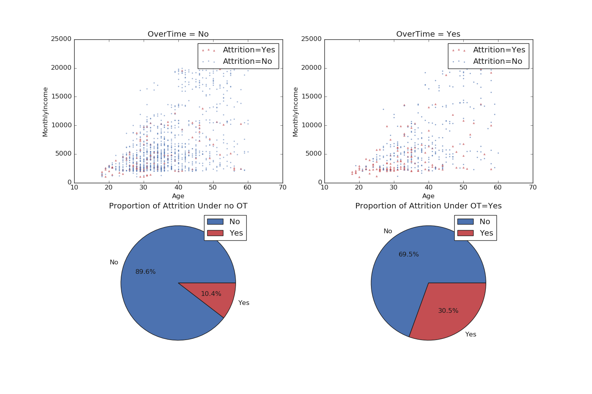

# viz-homework

The best figure is 'Attritionplt_age-monthlyI-OT.png'. Here, I can clearly see that there is a
much higher percentage of Attrition for those who have OverTime=Yes. It also shows that there
seems to be a cluster of low-income, low-age employees that have a higher Attrition.

(tbh, it was difficult for me to find nice graphics or to really understand the data).

